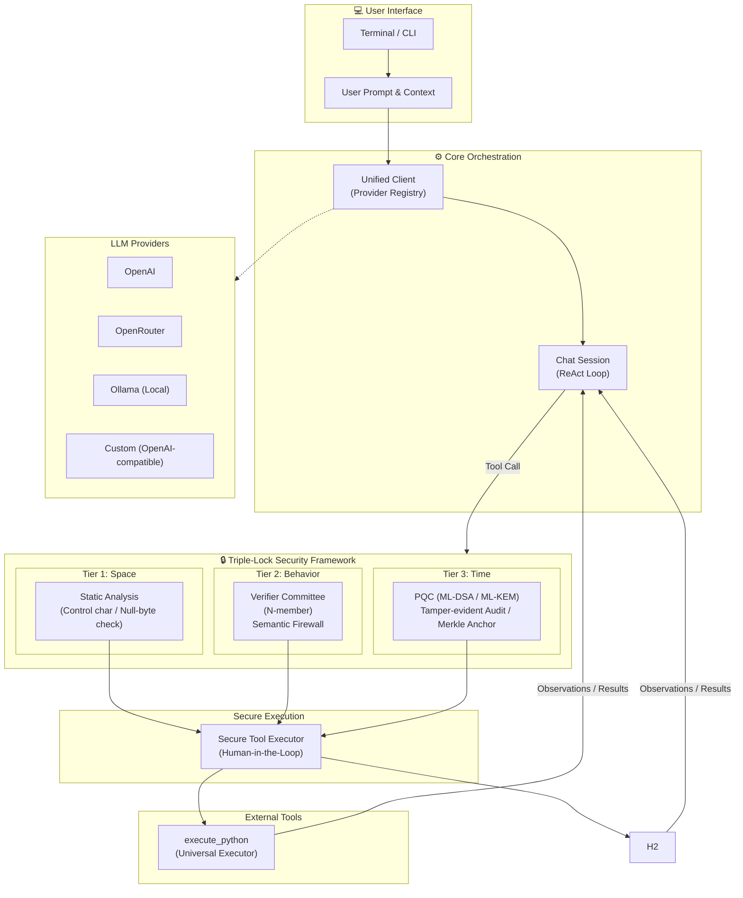

# llm-secure-cli: Unified OpenAI-Compatible CLI for AI Agents

[](https://github.com/yosh95/llm-secure-cli/actions/workflows/ci.yml)
[](LICENSE)
[](https://www.rust-lang.org)
[](https://zenodo.org/badge/latestdoi/1226929059)

`llm-secure-cli` (binary name: `llsc`) is a high-assurance command-line tool designed for interacting with Large Language Models (LLMs). It provides a unified, stable interface for any OpenAI-compatible API, including **OpenRouter, OpenAI, Ollama, and LiteLLM**, prioritizing cognitive focus, secure execution, and extensible automation.

---

### Purpose & Positioning

Enterprise adoption of autonomous AI agents faces a fundamental challenge: how to grant AI meaningful agency while maintaining security and governance standards.

This project explores practical solutions to this challenge through working code.

The framework implements CISSP/CISA/CCSP-level security principles (non-repudiation, PQC resilience) applied to the threat surface introduced by autonomous LLM agents. The design focuses on:

- Providing a reference architecture for high-assurance agentic systems.
- Enabling evaluation of practical trade-offs between AI agent autonomy and security controls.
- Supporting discussion of agentic AI governance through concrete implementation.

---

### Why Audit Logs? — Why AI Agents Need Auditing

Enterprise adoption of autonomous AI agents is hindered by two fundamental risks: destructive actions (unintended file modifications, system changes) and information leakage (exfiltration of sensitive data). Large Language Models are inherently black-box, stochastic systems — their behavior cannot be fully controlled or predicted through rules alone.

This tool addresses these challenges through two key mechanisms:

- **Verifier Committee (Multi-LLM Validation)**: Before any tool execution, N independent LLMs concurrently assess the proposed action for validity, safety, and information leakage risk. If any member flags a concern (under any-flag policy) or a majority does (under majority policy), the system escalates to Human-in-the-Loop (HITL) for approval.
- **Tamper-Evident Audit Logs**: Every action is recorded with its full reasoning chain — *why* the agent chose a particular tool with particular arguments — protected by chained hashing and PQC signatures (ML-DSA) to ensure non-repudiation and auditability.

The design philosophy draws inspiration from corporate governance: just as artificial persons (corporations) are controlled through mandatory auditing, autonomous AI agents — another form of non-human actor — require audit-based control to be safely entrusted with agency.

---

<p align="center">



  <br>
  <em>Simplified Architecture Flow</em>
</p>

---

## Quick Start

1. **Install**:
    ```bash
    # Install from source
    git clone https://github.com/yosh95/llm-secure-cli.git
    cd llm-secure-cli
    cargo install --path .
    ```
2. **Set API Keys**: `llsc` uses OpenAI-compatible APIs. Set keys for your chosen provider.
    ```bash
    # Example for OpenRouter
    export OPENROUTER_API_KEY="your-api-key"
    
    # Generic provider name support
    # ANYNAME_API_KEY can be used if you define [ANYNAME] in config.toml
    ```
> **Note:** This CLI intentionally omits a dedicated MCP (Model Context Protocol) client.
> The `execute_python` tool allows the LLM to communicate with any MCP server directly
> via Python's `requests` or similar libraries, making a native MCP client redundant.
> All external APIs are accessed through the universal executor, keeping the tool surface
> minimal and the security boundary simple. (A reference MCP test server is available at `examples/mcp_test_server.rs`.)

### 3. Chat: Type `llsc` to start an interactive session.

1. **Automatic Initialization**: On the first run, `~/.llsc/config.toml` is automatically created.
2. **Model Setup**: By default, no model is selected. Use `/model <model_name>` (e.g., `/model llama3`) to set one before your first request.
5. **Configure (Optional)**: Ollama is the default provider. To use OpenRouter or others, edit the configuration file:

    ```bash
    # Edit ~/.llsc/config.toml
    ```

6. **Help**: Type `/help` inside the chat to see all commands.

### Docker Isolation (Optional)
Run the agent in a completely isolated container to protect your host system.

1. **Build**: `docker build -t llm-secure-cli .`
2. **Setup API Keys**:
   - **Option A: `.env` file (Recommended)**: Place a `.env` file in your host's `~/.llsc/` directory.
     ```bash
     # ~/.llsc/.env
     OPENROUTER_API_KEY=sk-...
     OPENAI_API_KEY=sk-...
     ```
   - **Option B: Environment Variables**: Pass them via the `-e` flag during `docker run`.
3. **Run**:
   ```bash
   docker run -it --rm \
     -v ~/.llsc:/home/agent/.llsc \
     -v $(pwd):/workspace \
     llm-secure-cli -m llama3 "Summarize the files in this directory"
   ```

### One-Shot Examples
```bash
# Ask a question using the default provider (Ollama) and a specific model
llsc -m llama3 "What is the capital of France?"

# Use a specific provider and model (e.g., OpenRouter)
llsc -p openrouter -m google/gemini-2.0-flash-001 "Explain quantum computing"

# Output raw text to a file (disables Markdown rendering)
llsc -m llama3 --stdout --raw "Write a python script to sort files" > sort.py
```

## Core Features & Tools

- **Unified Provider Access**: Seamlessly switch between any OpenAI-compatible APIs (**OpenRouter, OpenAI, Ollama, LiteLLM**, and any custom OpenAI-compatible endpoint). Custom providers (e.g., Anthropic Claude, Google Gemini) can be added via config with the appropriate `formatter` setting (`"generic"` for standard OpenAI-compatible, `"high_feature"` for Anthropic/Gemini-style payload formatting with native PDF support).
- **Autonomous Agent**: A streamlined set of built-in tools for complex automation:
    - **Universal Executor**: `execute_python` — run arbitrary Python code for any file operation, data processing, or computation task.
    - **High-Assurance via Verifier Committee**: Every tool call is verified by the **Verifier Committee** — N independent LLMs operating under a configurable voting policy (majority or any-flag) — as a Semantic Firewall against unsafe or misaligned tool calls.
- **Operational Stability**: A clean, flicker-free UI designed for long-term "Deep Work" sessions.
- **Human-in-the-Loop**: The Verifier Committee auto-approves safe tool calls; potentially unsafe calls always require human confirmation.

### Autonomous Agent Capabilities
The AI agent autonomously selects tools to perform tasks. For example, it can search for a bug with Python file operations, read the relevant code, and apply a fix — all through `execute_python`. All actions are logged with cryptographic signatures for auditability.

---

## Security & Governance (High-Assurance Framework)

As a tool designed with **CISSP/CISA/CCSP** principles in mind, `llm-secure-cli` implements a multi-layered security architecture to mitigate the risks associated with autonomous AI agents.

### 1. Access Control (AI-native ABAC & Verifier Committee)
`llm-secure-cli` implements a modern **Attribute-Based Access Control (ABAC)**, moving away from fragile, platform-dependent static rules.
- **AI-native Policy Engine (Verifier Committee)**: Replaces complex regex blocklists with a hardcoded **Security Constitution**. The system automatically gathers context (OS, User, Directory, Git status) and uses N independent LLM verifiers to judge risks semantically using structured verdicts (ALLOW/REVIEW). This avoids the quagmire of platform-dependent static rules.
- **Configurable Voting Policy**: The Verifier Committee supports two voting policies configured via `committee_policy` in config.toml:
  - `"majority"` (default): Majority vote decides. Reduces unnecessary human review while maintaining strong security.
  - `"any-flag"` (conservative): If ANY member flags a call as requiring review, human approval is mandatory. Only if ALL members approve is the call auto-approved.
- **Path Guardrails (Verifier-based)**: Path validation is handled entirely by the Verifier Committee. The static path whitelist has been removed — the verifier LLM uses its inherent knowledge of sensitive paths (like `C:\Windows` or `/etc`) together with the user's intent context to determine whether a file access is safe.
- **PQC with Configurable Variants**: PQC signature (ML-DSA) and KEM (ML-KEM) variants are configurable via `[pqc]` section in config.toml, defaulting to ML-DSA-44 / ML-KEM-512 (NIST Level 2/1) for performance. Can be upgraded to ML-DSA-87 / ML-KEM-1024 (NIST Level 5) for maximum security.
- **Security Verification (Verifier Committee)**: Every tool call is verified by the Verifier Committee. This acts as a **Semantic Firewall**, ensuring the proposed tool call aligns with the user's intent, respects the Security Constitution (no destructive ops, no sensitive path access, no secret exfiltration), and providing corrected arguments if small discrepancies are detected.
- **Minimalist Fast-fail**: A lightweight syntactic check blocks only control characters and NULL bytes in **nanoseconds**, while the heavy lifting of security judgment is shifted to the Verifier Committee.
- **Verifier Fallback**: When the verifier is unavailable (network error, API failure), the system always asks for human approval.
- **Physical Isolation (Docker)**: The agent can be run inside a Docker container to provide a hard boundary between the AI and the host system.

### 2. Identity & Non-Repudiation (Experimental Reference)
- **Distributed Trust Model**: Implements a decentralized identity model where clients and servers only exchange public keys. This is designed to explore how to prevent lateral movement if a single component is compromised; however, it requires thorough evaluation before use in production environments.
- **Hybrid Identity Tokens**: Uses **COSE (RFC 9052)** binary structures combining **Ed25519** with **Post-Quantum Cryptography (ML-DSA)**. ML-DSA algorithm identifiers: ML-DSA-44 = `-85`, ML-DSA-65 = `-86`, ML-DSA-87 = `-87` (provisional, per draft-ietf-cose-dilithium).
- **Bi-directional Verification**: Tool results can be signed by the responder, allowing the requester to verify that the observations are authentic and untampered within the protocol's scope.

### 3. Observability & Audit Compliance (Tier 3 Reference Implementation)
- **Tamper-Evident Audit Logs**: Audit trails are protected using **Chained Hashing** and optionally encrypted with **ML-KEM (Kyber)** for confidentiality.
- **Merkle Tree Anchoring**: The Tier 3 implementation uses Merkle Trees to anchor log batches, demonstrating an architecture to prevent historical revisionism and provide compact proofs of session integrity.

---

## Advanced Commands & Power User Tips

### Command-Line Flags
```bash
llsc [SOURCES...]                    # Start interactive chat (optional initial text/files)
llsc -p <provider>                   # Start with specific provider
llsc -m <model>                      # Start with specific model
llsc --stdout                        # Non-interactive mode, output to stdout
llsc --raw                           # Disable Markdown rendering (use with --stdout)
llsc --session <path>                # Load a saved session on startup
llsc -D, --base-dir <path>           # Override base directory (default: ~/.llsc)
llsc "query"                         # One-shot query
```

### Subcommands
```bash
llsc keygen                          # Generate Ed25519 and PQC (ML-DSA/ML-KEM) key pairs
llsc verify-session <id>             # Verify session integrity using Merkle Anchor
llsc list-sessions                   # List available anchored sessions
llsc decrypt-log <input> [-o <out>]  # Decrypt PQC-encrypted audit logs
llsc credits [provider]              # Check API credits balance (OpenRouter only)
llsc rankings [provider]             # Show OpenRouter model rankings by token usage
```

### Interactive Session Commands
Inside the `llsc` interactive session:
- `/help`, `/h`: Show help message.
- `/quit`, `/q`: Exit the application.
- `/verifier`, `/v [add|delete <provider:model>|list]`: Manage verifier committee members (persisted to state.toml).
- `F2`: Open external editor to edit the current prompt (multi-line composition).
- `/clear`, `/c`: Clear conversation history.
- `/info`, `/i`: Show session info and security status.
- `/edit_history`, `/eh`: View/edit the conversation history in TOML format.
- `/raw`: Show conversation as raw text.
- `/session [load|delete <id>|clear]`: List, load, delete, or clear saved sessions.
- `/model`, `/m [-u] [<name>]`: List models or switch to `provider:model`. Use `-u` to refresh the cache.
- `/dump`: Dump the conversation history as TOML to stdout.
- `/credits`: Show detailed OpenRouter credit info.
- `/rankings`: Show OpenRouter model rankings by token usage.

### Keybindings
- **Newline**: `Ctrl+J` (Insert a newline without submitting).
- **Clear Screen**: `Ctrl+L`.
- **History**: `Up/Down` arrows to navigate.
- **Interrupt**: `Ctrl+C` to cancel the current thinking process or exit the session.
- **External Editor**: `F2` (Open external editor to edit the current prompt).

### Power User Tips
- **Backgrounding (`Ctrl+Z`)**: Suspend the session to perform shell operations, then use `fg` to return.
- **Prompt Continuation**: Use `\` at the end of a line or open a code block with ``` to enter multi-line mode automatically.
- **External Editor**: Press `F2` to open your default editor (`vim`, `nano`, etc.) for composing multi-line prompts.


---

## Environment Variables

| Variable | Description | Default |
|---|---|---|
| `LLM_SECURE_AUTO_APPROVE` | Automatically answer "Yes" to all confirmation prompts (for testing). | unset (off) |
| `LLM_CLI_KEY_PASSPHRASE` | Passphrase for encrypted key storage. | — |
| `LLM_CLI_KEY_PASSPHRASE_FILE` | Path to a file containing the passphrase. | — |

Provider API keys are read from environment variables (e.g., `OPENROUTER_API_KEY`, `OPENAI_API_KEY`, `OLLAMA_API_KEY`) or from `~/.llsc/.env`.

---

## Configuration Reference

The primary security configuration is in `src/config/defaults.toml` (overridden by `~/.llsc/config.toml`). Runtime-persisted data (verifier committee members) is stored in `~/.llsc/state.toml`.

```toml
# ~/.llsc/config.toml

[general]
request_timeout = 300          # seconds (default Rust struct: 1800)
python_timeout = 300          # seconds (default Rust struct: 3600)
image_save_path = "~/Pictures/llsc"
max_audit_log_lines = 10000
max_chat_log_lines = 5000
max_chat_archives = 5
max_output_lines = 5000
max_output_chars = 50000

[security]
auto_approve = false           # Dangerous: bypasses all user confirmation
verifier_enabled = true        # Master switch for Verifier Committee

# Verifier Committee members (fallback when state.toml is empty):
# verifier_committee = ["ollama:gemma4:e2b", "openai:gpt-4o-mini"]

# Voting policy: "majority" (default) or "any-flag"
# committee_policy = "majority"

[pqc]
# Signature variant: "ml-dsa-44" (default), "ml-dsa-65", or "ml-dsa-87"
# signature_variant = "ml-dsa-44"

# KEM variant: "ml-kem-512" (default), "ml-kem-768", or "ml-kem-1024"
# kem_variant = "ml-kem-512"
```

### Verifier Committee Configuration
The Verifier Committee uses N independent LLM verifiers. Configure verifier members via the `/verifier` interactive command or directly in `state.toml`:

```toml
# ~/.llsc/state.toml
verifier_committee = ["ollama:gemma4:e2b", "openai:gpt-4o-mini", "openrouter:anthropic/claude-3-haiku"]
last_model = "openai:gpt-4o"
```

**Note**: The `verifier_committee` list in config.toml serves as a **fallback** when state.toml has no runtime-configured members. Use `/verifier add|delete` to manage members at runtime — these are persisted to state.toml.

---

## Development & Benchmarks

### Local Security Benchmarks
To run the local security primitive benchmarks (Static Analysis, PQC Keygen/Sign/Verify):
```bash
cargo bench --bench benchmark_local
```

### Verifier Benchmarks
To run the internal Verifier benchmark scenarios (requires API keys):
```bash
# Basic usage
cargo bench --bench benchmark_verifier -- <provider> <model>

# Example: Run with OpenRouter
cargo bench --bench benchmark_verifier -- openrouter amazon/nova-2-lite-v1

# Example: Run with Ollama
cargo bench --bench benchmark_verifier -- ollama llama3

# Or with a custom scenarios JSON file:
cargo bench --bench benchmark_verifier -- <provider> <model> path/to/your_scenarios.json
```

---

## Development

### Prerequisites

- **Rust** 1.95.0 or later (edition 2024)
- **[just](https://github.com/casey/just)** — a modern command runner (optional, but recommended)

### Quick Checks with `just`

The project includes a `justfile` with common recipes:

```bash
# Show all available commands
just

# Format code
just fmt

# Run clippy with strict lints
just clippy

# Run all tests
just test

# Full CI pipeline (format → clippy → test → build-release)
just ci

# Install the binary locally
just install

# Run the application
just run
```

### CI/CD

CI runs on every push and pull request via [GitHub Actions](.github/workflows/ci.yml):

| Job | Description |
|-----|-------------|
| **Format** | `cargo fmt --check` |
| **Build & Test** | `cargo clippy`, `cargo build --release`, `cargo test` on Ubuntu, macOS, and Windows |
| **Security Audit** | `cargo audit` for dependency vulnerabilities, `cargo deny` for supply-chain security (advisories, licenses, crate duplicates) |
| **Docs** | `cargo doc` with warnings as errors |

### Running Benchmarks

```bash
# Local security primitive benchmarks
just bench-local

# Verifier benchmarks (requires API keys)
just bench-verifier openrouter google/gemini-3.1-flash-lite
```

---

## Disclaimer

**This tool is not certified or validated for enterprise production use.** No formal third-party security audit has been conducted, and the PQC primitives rely on Rust implementations that have not undergone independent cryptographic review. Deploying this in a regulated or mission-critical environment without additional validation would be inappropriate.

Users should:
- Conduct independent security reviews before production deployment.
- Validate PQC implementations for their specific use cases.
- Understand the limitations of the current implementation.

---

## License
Licensed under [Apache License 2.0](LICENSE).
