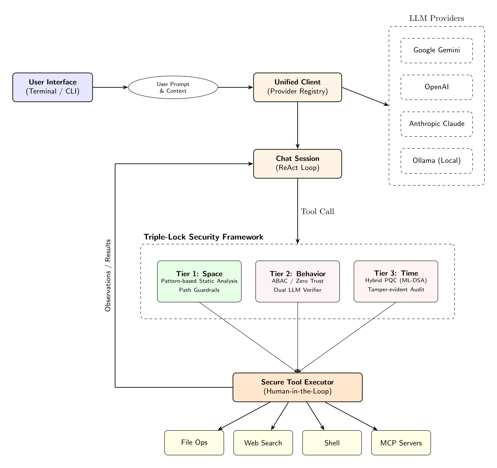

# llm-secure-cli: A Unified Terminal Interface for Multiple LLMs

`llm-secure-cli` (binary name: `llsc`) is a high-assurance command-line tool designed for interacting with Large Language Models (LLMs). It provides a unified, stable interface for Gemini, OpenAI, Claude, and local models via Ollama, prioritizing cognitive focus, secure execution, and extensible automation.

[English] | [日本語](#japanese-description)

---

###  Purpose & Positioning

Enterprise adoption of autonomous AI agents faces a fundamental, unsolved challenge: **how do you grant an AI meaningful agency while maintaining the security and governance standards that organizations require?** This project is one engineer's attempt to answer that question in working code.

`llm-secure-cli` was built primarily as a **personal daily-use tool** and as a **portfolio artifact** — a concrete demonstration of how CISSP/CISA/CCSP-level security principles (Zero Trust, ABAC, non-repudiation, PQC resilience) can be applied to the novel threat surface introduced by autonomous LLM agents.

**This tool is not certified or validated for enterprise production use.** No formal third-party security audit has been conducted, and the PQC primitives rely on Rust implementations that have not undergone independent cryptographic review. Deploying this in a regulated or mission-critical environment without additional validation would be inappropriate.

Instead, its recommended uses are:

-  **As a reference architecture** — for security engineers and architects exploring what a high-assurance agentic system *could* look like.
-  **As an evaluation platform** — for studying the practical trade-offs between AI agent autonomy and hybrid high-assurance security controls.
-  **As a design provocation** — a starting point for organizational discussions on agentic AI governance, not a finished answer.

The accompanying [Technical Report](paper/comprehensive_framework/paper.pdf) details the threat model and architectural decisions behind this framework.

---

<p align="center">
  
  <br>
  <em>Simplified Architecture Flow</em>
</p>

---

##  Quick Start

1.  **Install**:
    ```bash
    # Install from source
    git clone https://github.com/yosh95/llm-secure-cli-rust.git
    cd llm-secure-cli-rust
    cargo install --path .
    ```
2.  **Set API Keys**: `llsc` requires API keys to be set as environment variables.
    ```bash
    export GEMINI_API_KEY="your-api-key"
    # Supported: GEMINI_API_KEY, OPENAI_API_KEY, ANTHROPIC_API_KEY
    # Ollama: No API key required for local use.
    ```
3.  **Chat**: Type `llsc` to start an interactive session.
    *   **Automatic Initialization**: On the first run, `~/.llm_secure_cli/config.toml` is automatically created.
    *   **Native Web Search**: Gemini, OpenAI, and Claude support built-in web search automatically using your provider API key.
    *   **Brave Search**: Support for the Brave Search API is also available for comprehensive searching across all providers (requires `BRAVE_API_KEY`). **Note**: When Brave Search is enabled, provider-native search is automatically disabled to ensure a consistent, auditable, and PQC-signed search path.
4.  **Configure (Optional)**: To customize behavior or add MCP servers, edit the configuration file:
    ```bash
    # Edit ~/.llm_secure_cli/config.toml to modify settings.
    ```
5.  **Help**: Type `/help` inside the chat to see all commands.

### One-Shot Examples
```bash
# Ask a question using the default provider (Gemini)
llsc "What is the capital of France?"

# Use a specific provider and model
llsc -p anthropic -m sonnet "Explain quantum computing"

# Analyze a local file or a URL
llsc "Summarize this PDF" ./document.pdf
llsc "Analyze this website" https://example.com

# List available models
llsc models

# Benchmark provider latency
llsc benchmark openai gpt-4o
```

## Core Features

- **Unified Provider Access**: Seamlessly switch between Google (Gemini), OpenAI, Anthropic (Claude), and **Local LLMs (Ollama)**.
- **Autonomous Agent**: Let the AI manage files and search the web using **Provider-Native Search** (Gemini Grounding, OpenAI/Claude Web Search) or **Brave Search**.
- **High-Assurance via Dual LLM**: Every high-risk tool call is verified by a secondary LLM to ensure intent alignment, balancing flexibility and security.
- **Config-free Execution**: Start using immediately by just providing an environment variable.
- **MCP (Model Context Protocol) Support**: Connect to remote resources or services via custom servers configured in `config.toml`.
- **Multimodal capabilities**: Support for Images, PDFs, Audio, and Video. Image generation is also supported for compatible models.
- **Operational Stability**: A clean, flicker-free UI designed for long-term "Deep Work" sessions and SSH-based environments.
- **Human-in-the-Loop**: All critical actions (file edits, code execution) require explicit human approval by default.

### Autonomous Agent & Tool Use
The AI agent autonomously uses tools to perform complex tasks, such as file management, web search, and Python execution. Web search is powered by the LLM provider's native capabilities (Gemini Grounding, OpenAI/Claude Web Search) or the Brave Search API. To maintain audit integrity, **Brave Search takes precedence**; if it is configured, native search is disabled to ensure all external data retrieval is cryptographically signed and logged.

---

## Security & Governance (High-Assurance Framework)

As a tool designed with **CISSP/CISA/CCSP** principles and **EU AI Act** compliance in mind, `llm-secure-cli` implements a multi-layered security architecture to mitigate the risks associated with autonomous AI agents.

### 1. Access Control (ABAC)
`llm-secure-cli` implements **Attribute-Based Access Control (ABAC)**, providing granular security based on execution context and resource attributes.
- **Custom Rule Engine**: Define fine-grained policies in `config.toml` based on user identity, environment (Git branch, OS), and PQC verification status.
- **Risk-based Scaling**: Security requirements automatically scale based on the tool's risk level (HIGH/MEDIUM/LOW).
- **Intent Verification (Dual LLM)**: High-risk actions are cross-verified by a separate, lightweight "Verifier" LLM (e.g., Gemini Flash Lite) to ensure the proposed tool call aligns with the user's original intent, mitigating sophisticated prompt injection. 
  - **Asynchronous Execution**: To minimize latency, verification runs in the background while the user reviews the tool's explanation. The result is synchronized at the moment of approval, providing a seamless high-assurance experience.
  - In `high` security mode, a functional Dual LLM provider is **required**.
  - If the secondary LLM is misconfigured or unreachable (Soft Failure), the system will fallback to explicit manual user approval rather than failing open.
  - If the intent check actively rejects the call (Hard Block), the execution is strictly denied.
- **Identity Proof**: High-risk actions require a valid **PQC-signed identity token**. In `high` mode, execution is blocked if keys are missing.
- **Compatibility Mode**: Use `LLM_CLI_SECURITY_LEVEL=standard` or set `security_level = "standard"` in `config.toml` to enable interoperability with non-llm-secure-cli clients or legacy MCP servers, downgrading PQC enforcement and integrity checks to warnings.
  ```toml
  [security]
  security_level = "standard"
  ```
- **Pattern-based Static Analysis**: Every tool command and argument is inspected before execution to block dangerous patterns (`rm -rf /`, `mkfs`, etc.) and ensure system integrity. This lightweight analysis provides deterministic safety boundaries with minimal overhead.
- **Path Guardrails**: Tools are restricted by path attributes (defaulting to the current directory). The policy engine now inspects multiple argument names (`path`, `directory`, `file`, `src`, `dest`, etc.) to prevent bypass.
- **Tool Whitelisting**: A restricted list of authorized tools (both built-in and remote MCP) can be defined in `config.toml`. Only whitelisted tools will be registered, providing an additional layer of defense-in-depth by reducing the available attack surface.
  ```toml
  [security]
  allowed_tools = ["read_file_content", "grep_files", "brave_search"] # Only these tools will be loaded
  ```
- **Explanation Enforcement**: Every tool mandates an `explanation` parameter, forcing the LLM to justify its intent.

### 2. Identity & Non-Repudiation (Experimental Reference)
- **Distributed Trust Model**: Implements a decentralized identity model where clients and servers only exchange public keys. This is designed to explore how to prevent lateral movement if a single component is compromised; however, it requires thorough evaluation before use in production environments.
- **Hybrid Identity Tokens**: Uses **COSE (RFC 9052)** binary structures combining **RS256** with **Post-Quantum Cryptography (ML-DSA)**. This serves as a reference for how long-term non-repudiation might be handled in autonomous agent systems.
- **Client Integrity Attestation**: The client generates a signed manifest of its own source code state to demonstrate the integrity of the execution environment.
- **Bi-directional Verification**: Tool results can be signed by the responder, allowing the requester to verify that the observations are authentic and untampered within the protocol's scope.

### 3. Observability & Audit Compliance (Tier 3 Reference Implementation)
- **Tamper-Evident Audit Logs**: Audit trails are protected using **Chained Hashing** and optionally encrypted with **ML-KEM (Kyber)** for confidentiality.
- **Merkle Tree Anchoring**: The Tier 3 implementation uses Merkle Trees to anchor log batches, demonstrating an architecture to prevent historical revisionism and provide compact proofs of session integrity.

---

##  Advanced Commands & Power User Tips

Inside the `llsc` interactive session:
- `/help`, `/h`: Show this help message.
- `/quit`, `/q`: Exit the application.
- `/date`, `/d`: Send current date and time to LLM.
- `/p <provider>` / `/m <model>`: Switch the AI engine on the fly.
- `/attach <path/URL>`: Add a file or website content to the context.
- `/tools [on|off]`: Show or toggle autonomous tool use status.
- `/i`: Show session info, integrity, and security status.
- `/save <path>` / `/load <path>`: Manage conversation history.
- `/clear`, `/c`: Clear conversation history.
- `/edit`, `/e`: Edit current buffer in external editor.
- `/raw`: Show conversation as raw text.
- `/dump`: Dump conversation history as JSON.
- `/cp`: Checkpoint (Summarize and clear history).
- `/reload`: Reload configuration from disk.

### Keybindings
- **Newline**: `Ctrl+J` (Insert a newline without submitting).
- **Clear Screen**: `Ctrl+L`.
- **History**: `Up/Down` arrows to navigate.
- **Interrupt**: `Ctrl+C` to cancel the current thinking process or exit the session.

###  Logging & Troubleshooting
By default, `llsc` and its related tools suppress all informational logs and only show `WARNING` or `ERROR` messages. If you encounter issues:
- **Enable Debug Mode**: Add the `--debug` flag to see detailed execution logs:
  ```bash
  llsc --debug "query"
  llsc --debug identity verify
  ```
- **MCP Debugging**: To troubleshoot the MCP server (which is often spawned by a third-party client), use the `MCP_DEBUG` environment variable:
  ```bash
  export MCP_DEBUG=1
  # Then start your MCP client (e.g., Claude Desktop)
  ```
- **Log Location**: Security and audit logs are stored in `~/.llm_secure_cli/audit.jsonl`.

### Power User Tips
- **Backgrounding (`Ctrl+Z`)**: Suspend the session to perform shell operations, then use `fg` to return.
- **Prompt Continuation**: Use `\` at the end of a line or open a code block with ``` to enter multi-line mode automatically.
- **External Editor**: Use `/edit` (or `/e`) for composing complex prompts in your default editor (`vim`, `nano`, etc.).
- **Model-specific Tool Disabling**: For models that do not support tool use (e.g., image generation models), you can pre-configure them to disable tools automatically in `config.toml`:
  ```toml
  [google.models]
  image = { model = "gemini-3.1-flash-image-preview", tools = false }
  ```
- **Disabling Tools Manually**: Use `/tools off` to prevent errors when using a model that doesn't support function calling.

## Security Management
Use the `llsc` command with the `identity` or `decrypt-log` subcommands to manage your cryptographic identity and audit logs:
```bash
llsc identity keygen          # Generate RSA and PQC (ML-DSA/ML-KEM) keys
llsc identity manifest        # Rebuild integrity manifest for system verification
llsc identity verify          # Run full integrity verification
llsc identity verify-session <trace-id>  # Verify session integrity using Merkle Anchor
llsc identity list-sessions   # List available anchored sessions
llsc decrypt-log <input>      # Decrypt PQC-encrypted audit logs
```

## Utility Commands
```bash
llsc models                   # List available models for active providers
llsc benchmark <provider> <model>  # Benchmark Dual LLM verification latency
```

## Development & Benchmarks
To run the local security primitive benchmarks (Static Analysis, PQC Keygen/Sign/Verify):
```bash
cargo run --bin benchmark_local
```

To run the internal Dual LLM verification scenarios (requires API keys):
```bash
cargo run --bin benchmark_dual_llm
```

##  License
Licensed under [Apache License 2.0](LICENSE). 

For detailed architectural insights and the academic background of our security framework, please refer to the **[Technical Report (Pre-print)](paper/comprehensive_framework/paper.pdf)**.

---

<a id="japanese-description"></a>

# llm-secure-cli: 複数LLM対応 統合コマンドラインインターフェース

`llm-secure-cli`（バイナリ名：`llsc`）は、Gemini, OpenAI, Claude、および Ollama を介したローカルLLMを一元的に操作できる、高い安全性を備えたCLIツールです。開発者の「深い集中（Deep Work）」を妨げない安定した対話環境と、プロフェッショナルな要求に応える高度なセキュリティ機能を両立しています。

[English] | [日本語]

---

###  位置づけと目的

企業における自律型 AI エージェントの活用には、根本的かつ未解決の課題があります。**「AIに十分な自律性を与えながら、組織が求めるセキュリティ標準とガバナンスをどう両立させるか」**――本プロジェクトは、その問いに対してエンジニアが動くコードで答えを試みたものです。

`llm-secure-cli` は主に**個人の日常利用ツール**として、また**ポートフォリオ**として開発されました。Zero Trust・ABAC・非否認性・耐量子暗号といった CISSP/CISA/CCSP レベルのセキュリティ原則を、自律型 LLM エージェントがもたらす新しい脅威対象に適用すると、実装としてどのような形になるかを具体的に示すことを目的としています。

**本ツールは、エンタープライズ本番環境への適用を保証・認定するものではありません。** 第三者による正式なセキュリティ監査は実施されておらず、PQC プリミティブは独立した暗号学的レビューを受けていない Rust 実装に依存しています。規制対象業務やミッションクリティカルな環境への追加検証なしでの展開は推奨しません。

本プロジェクトの推奨される活用方法は以下のとおりです。

-  **参照アーキテクチャとして** ― 高保証なエージェントシステムが「どのような設計になりえるか」を探求するセキュリティエンジニア・アーキテクト向け。
-  **評価プラットフォームとして** ― AI エージェントの自律性とハイブリッドな高保証セキュリティ制御の間にある実践的なトレードオフを検討するための実験基盤として。
-  **設計上の問いかけとして** ― 組織内における AI エージェントのガバナンス議論の起点として。完成した答えではなく、問いを深めるための素材として。

設計の背景にある脅威モデルとアーキテクチャ上の意思決定については、[テクニカルレポート](paper/comprehensive_framework/paper.pdf)で詳述しています。

---

<p align="center">
  
  <br>
  <em>簡易アーキテクチャフロー (TikZ版)</em>
</p>

---

##  クイックスタート

1.  **インストール**:
    ```bash
    # ソースからインストール
    git clone https://github.com/yosh95/llm-secure-cli-rust.git
    cd llm-secure-cli-rust
    cargo install --path .
    ```
2.  **APIキーの設定**: APIキーを環境変数として設定します。
    ```bash
    export GEMINI_API_KEY="your-api-key"
    # 対応: GEMINI_API_KEY, OPENAI_API_KEY, ANTHROPIC_API_KEY
    # Ollama: ローカル利用の場合、APIキーは不要です。
    ```
3.  **対話開始**: `llsc` コマンドでスタート。
    *   **設定の自動生成**: 初回起動時に `~/.llm_secure_cli/config.toml` が自動的に作成されます。
    *   **ネイティブWeb検索**: Gemini, OpenAI, Claude はプロバイダーのAPIキーのみで、組み込みのWeb検索（Grounding等）を自動的に利用可能です。別途検索APIキーを用意する必要はありません。
    *   **Brave Search**: すべてのプロバイダーで利用可能な共通のWeb検索ツールとして Brave Search API をサポートしています（`BRAVE_API_KEY` が必要）。**注意**: Brave Search が有効な場合、一貫した監査ログと署名（PQC）を確保するため、プロバイダー独自のネイティブ検索は自動的に無効化されます。
4.  **詳細設定 (任意)**: MCPサーバーの追加や動作のカスタマイズを行いたい場合は、生成された設定ファイルを編集します。
    ```bash
    # ~/.llm_secure_cli/config.toml を編集して設定を調整してください。
    ```
5.  **ヘルプ**: チャット内で `/help` と入力するとコマンド一覧が表示されます。

### ワンショット実行例
```bash
# デフォルトのプロバイダー（Gemini）で質問する
llsc "フランスの首都はどこですか？"

# 特定のプロバイダーとモデルを指定する
llsc -p anthropic -m sonnet "量子コンピュータについて説明して"

# ローカルファイルやURLを解析する
llsc "このPDFを要約して" ./document.pdf
llsc "このWebサイトを解析して" https://example.com

# 利用可能なモデル一覧を表示する
llsc models

# プロバイダーのレイテンシを測定する
llsc benchmark openai gpt-4o
```

## 主な機能 (実用ツールとして)

- **統合インターフェース**: `llsc` コマンド一つで主要なクラウドLLMと **Ollama (Local)** にアクセス。
- **自律型エージェント**: ファイル操作、Web検索、URL解析をAIが自律的に実行。Web検索はプロバイダー提供の**ネイティブ検索機能**（Gemini Grounding, OpenAI/Claude Web Search等）または **Brave Search** を使用します。
- **Dual LLM による高保証**: 全ての高リスクなツール実行はセカンダリLLMによって検証され、柔軟性と安全性を両立しています。
- **設定不要の即時利用**: 環境変数を設定するだけで、セットアップの手間なく利用可能。
- **MCP (Model Context Protocol) 対応**: `config.toml` に設定されたリモートサーバーや外部サービスとの連携をサポート。
- **マルチモーダル対応**: 画像、PDF、音声、動画の入力をサポート。対応モデルでの画像生成も可能。
- **集中力を削がないUI**: 画面のちらつきを抑え、SSH越しでも安定して動作するクリーンなターミナル出力。
- **Human-in-the-Loop**: ファイル編集やコード実行などの重要な操作は、デフォルトで人間の明示的な承認を必要とします。

### 自律型エージェントのツール実行
AIがファイル操作、Web検索、Python実行などのツールを自律的に使用し、複雑なタスクを遂行します。Web検索はLLMプロバイダーの機能（Gemini Grounding, OpenAI/Claude Web Search）または Brave Search API を利用します。監査の健全性を維持するため、**Brave Search が優先されます**。Brave Search が設定されている場合、すべての外部データ取得が暗号学的に署名・記録されることを保証するため、ネイティブ検索は無効化されます。

## セキュリティとガバナンス (プロフェッショナル向け)

本ツールは **CISSP/CISA/CCSP** の各ドメインにおける管理策、および **EU AI Act（欧州AI法）** の技術的要件を意識して設計されています。

### 1. 属性ベースアクセス制御 (ABAC)
`llm-secure-cli` は、実行コンテキストとリソース属性に基づいた **属性ベースアクセス制御 (ABAC)** を採用し、高度に粒度の細かいセキュリティを実現しています。
- **カスタムルールエンジン**: ユーザー識別子、環境（Gitブランチ、OS）、PQC検証ステータスなどに基づいた詳細なポリシーを `config.toml` で定義可能です。
- **リスクベース・スケーリング**: ツールのリスクレベル（HIGH/MEDIUM/LOW）に応じて、要求されるセキュリティ強度が自動的に変化します。
- **意図の検証 (Dual LLM)**: 高リスクな操作は、軽量な「検証用LLM」（例：Gemini Flash Lite）によって元のプロンプトと照合されます。これにより、高度なプロンプトインジェクションによる意図しない操作を動的に防止します。
  - **バックグラウンド実行**: 検証はユーザーが説明文を確認して承認（HITL）を行う裏で非同期に実行されます。これにより、高度な検証に伴う待機時間を最小化し、ストレスのない操作感を実現しています。
  - `high` セキュリティモードでは、機能する Dual LLM プロバイダーの設定が **必須** です。
  - セカンダリLLMが未設定または到達不能な場合（Soft Failure）、フェイルオープンを防ぐため、システムは常に手動のユーザー承認にフォールバックします。
  - 意図チェックが明示的に拒絶した場合（Hard Block）、実行は厳格に拒否されます。
- **アイデンティティ証明**: 高リスクな操作には、**耐量子暗号 (PQC)** による署名付き証明が必要です。`high` モードでは、鍵が不足している場合、実行がブロックされます。
- **互換モード**: `LLM_CLI_SECURITY_LEVEL=standard` を環境変数で設定するか、`config.toml` 内で `security_level = "standard"` を設定することで、PQC非対応のクライアントやサーバーとの相互運用を許可し、整合性チェックのエラーを警告表示のみにダウングレードします。
  ```toml
  [security]
  security_level = "standard"
  ```
- **パターンベースの静的解析**: 全てのツールコマンドと引数は実行前に解析され、危険なパターン（`rm -rf /`, `mkfs`等）を遮断します。この軽量な解析により、最小限のオーバーヘッドで決定論的な安全境界を提供します。
- **パス・ガードレール**: 操作可能な範囲を属性（ディレクトリ・パスなど）で制限します。ポリシーエンジンは複数の引数名（`path`, `directory`, `file`, `src`, `dest`など）を検査し、バイパスを防止します。
- **ツールのホワイトリスト化**: `config.toml` で許可するツール（組み込みおよびリモートMCP）を明示的に指定できます。ホワイトリストに記載されていないツールはレジストリに登録されず、攻撃表面を最小限に抑える防御層として機能します。
  ```toml
  [security]
  allowed_tools = ["read_file_content", "grep_files", "brave_search"] # 指定したツールのみがロードされます
  ```
- **説明の強制**: 全てのツールは `explanation` パラメータを必須とし、LLMにその意図を正当化させます。

### 2. アイデンティティと非否認性 (実験的参照実装)
- **分散型トラストモデル**: クライアントとサーバーが公開鍵のみを交換する分散型アイデンティティモデルを実装。特定のコンポーネントが侵害された際の横展開を防止する手法を探求していますが、エンタープライズ領域での利用には十分な評価が必要です。
- **ハイブリッド署名**: **COSE (RFC 9052)** を採用し、**RS256** と **耐量子暗号 (ML-DSA)** を組み合わせた署名を実装。将来的な非否認性の確保に向けた参照実装としての位置づけです。
- **完全性検証**: クライアント自身のソースコードの状態を署名付きマニフェストで証明し、実行環境の健全性を担保します。
- **双方向検証**: ツールの実行結果に署名を付与し、受信側がデータの正当性をプロトコルの範囲内で検証可能です。

### 3. 観測可能性と監査ログ (Tier 3 参照実装)
- **改ざん防止監査ログ**: ハッシュ連鎖（Chained Hashing）によるログ保護と、**ML-KEM (Kyber)** による機密性保護を実装しています。
- **Merkle Tree アンカリング**: Tier 3 実装として Merkle Tree によるログバッチの固定を導入。履歴の改ざんを防止し、セッションの整合性を証明するアーキテクチャのプロトタイプです。

---

###  高度なコマンドとパワーユーザー向け機能

`llsc` インタラクティブセッション内で利用可能なコマンド:
- `/help`, `/h`: ヘルプメッセージを表示。
- `/quit`, `/q`: アプリケーションを終了。
- `/date`, `/d`: 現在の日時をシステムメッセージとしてLLMに送信。
- `/p <provider>` / `/m <model>`: プロバイダーやモデルを動的に切り替え。
- `/attach <path/URL>`: ファイルやウェブサイトのコンテンツをコンテキストに追加。
- `/tools [on|off]`: ツールの自律実行ステータスの表示・切り替え。
- `/i`: セッション情報、整合性、およびセキュリティステータスを表示。
- `/save <path>` / `/load <path>`: 会話履歴の保存・読み込み。
- `/clear`, `/c`: 会話履歴をクリア。
- `/edit`, `/e`: 外部エディタで現在の入力を編集。
- `/raw`: 会話をそのままのテキストとして表示。
- `/dump`: 会話履歴をJSON形式でダンプ。
- `/cp`: チェックポイント (会話の要約と履歴のクリア)。
- `/reload`: 設定をディスクから再読み込み。

### キーバインド
- **改行**: `Ctrl+J` (送信せずに次の行へ移動)。
- **画面クリア**: `Ctrl+L`。
- **履歴移動**: `↑`/`↓` キー。
- **中断**: `Ctrl+C` (生成の中断、またはセッションの終了)。

###  ログとトラブルシューティング
デフォルトでは、`llsc` およびその関連ツールは、`WARNING` または `ERROR` メッセージのみを表示し、情報のログは表示されません。
- **デバッグモードの有効化**: ツールの実行時に `--debug` フラグを追加して、詳細なログを表示します。
  ```bash
  llsc --debug "query"
  llsc --debug identity verify
  ```
- **MCP のデバッグ**: 3rdパーティのクライアント（Claude Desktop 等）から起動される MCP サーバーのトラブルシューティングには、`MCP_DEBUG` environment変数を使用します。
  ```bash
  export MCP_DEBUG=1
  # その後、お使いの MCP クライアントを起動してください。
  ```
- **ログの場所**: セキュリティおよび監査ログは `~/.llm_secure_cli/audit.jsonl` に保存されています。

### パワーユーザー向け機能
- **一時中断 (`Ctrl+Z`)**: セッションをバックグラウンドに送り、シェルに戻る。`fg` で復帰可能。
- **入力の継続**: 行末に `\` を入力するか、` ``` ` でコードブロックを開始することで、自動的に複数行入力モードになります。
- **外部エディタ**: `/edit` (または `/e`) と入力することで、`vim` や `nano` などのデフォルトエディタで編集できます。複雑なプロンプトを作成する際に便利です。
- **モデルごとのツール自動無効化**: 画像生成モデルなど、ツール利用に対応していないモデルに対して、`config.toml` で自動的にツール機能をオフに設定できます。
  ```toml
  [google.models]
  image = { model = "gemini-3.1-flash-image-preview", tools = false }
  ```
- **ツール機能の手動無効化**: `/tools off` コマンドでツール送信を一時的に無効化できます。

## セキュリティ管理
`llsc` コマンドの `identity` または `decrypt-log` サブコマンドを使用して、暗号化アイデンティティと監査ログを管理します。
```bash
llsc identity keygen          # RSA および PQC (ML-DSA/ML-KEM) 鍵ペアの生成
llsc identity manifest        # システム検証のための整合性マニフェストの再構築
llsc identity verify          # 完全な整合性検証の実行
llsc identity verify-session <trace-id>  # Merkle Anchorを用いたセッション整合性の検証
llsc identity list-sessions   # アンカーされた利用可能なセッションの一覧表示
llsc decrypt-log <input>      # 耐量子暗号（PQC）で暗号化された監査ログの復号
```

## ユーティリティコマンド
```bash
llsc models                   # アクティブなプロバイダーの利用可能モデルを表示
llsc benchmark <provider> <model>  # Dual LLM検証のレイテンシを測定
```

## 開発とベンチマーク
ローカルのセキュリティプリミティブ（静的解析、PQC鍵生成/署名/検証）のベンチマークを実行するには：
```bash
cargo run --bin benchmark_local
```

内部的な Dual LLM 検証シナリオを実行するには（APIキーが必要）：
```bash
cargo run --bin benchmark_dual_llm
```

##  License
Licensed under [Apache License 2.0](LICENSE). 

For detailed architectural insights and the academic background of our security framework, please refer to the **[Technical Report (Pre-print)](paper/comprehensive_framework/paper.pdf)**.
