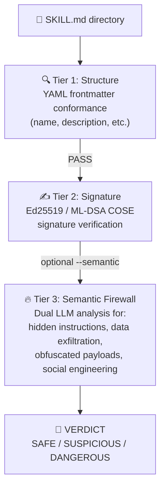

# llm-secure-cli: Unified OpenAI-Compatible CLI for AI Agents

[](https://github.com/yosh95/llm-secure-cli/actions/workflows/ci.yml)
[](LICENSE)
[](https://www.rust-lang.org)

`llm-secure-cli` (binary name: `llsc`) is a high-assurance command-line tool designed for interacting with Large Language Models (LLMs). It provides a unified, stable interface for any OpenAI-compatible API, including **OpenRouter, OpenAI, Ollama, and LiteLLM**, prioritizing cognitive focus, secure execution, and extensible automation.

---

###  Purpose & Positioning

Enterprise adoption of autonomous AI agents faces a fundamental, unsolved challenge: **how do you grant an AI meaningful agency while maintaining the security and governance standards that organizations require?** This project is one engineer's attempt to answer that question in working code.

`llm-secure-cli` was built primarily as a **personal daily-use tool** and as a **portfolio artifact** — a concrete demonstration of how CISSP/CISA/CCSP-level security principles (Zero Trust, ABAC, non-repudiation, PQC resilience) can be applied to the novel threat surface introduced by autonomous LLM agents.

**This tool is not certified or validated for enterprise production use.** No formal third-party security audit has been conducted, and the PQC primitives rely on Rust implementations that have not undergone independent cryptographic review. Deploying this in a regulated or mission-critical environment without additional validation would be inappropriate.

Instead, its recommended uses are:

-  **As a reference architecture** — for security engineers and architects exploring what a high-assurance agentic system *could* look like.
-  **As an evaluation platform** — for studying the practical trade-offs between AI agent autonomy and hybrid high-assurance security controls.
-  **As a design provocation** — a starting point for organizational discussions on agentic AI governance, not a finished answer.

The accompanying [Technical Report](paper/comprehensive_framework/paper.pdf) details the threat model and architectural decisions behind this framework.

---

<p align="center">
  
  <br>
  <em>Simplified Architecture Flow</em>
</p>

---

##  Quick Start

1.  **Install**:
    ```bash
    # Install from source
    git clone https://github.com/yosh95/llm-secure-cli.git
    cd llm-secure-cli
    cargo install --path .
    ```
2.  **Set API Keys**: `llsc` uses OpenAI-compatible APIs. Set keys for your chosen provider.
    ```bash
    # Example for OpenRouter
    export OPENROUTER_API_KEY="your-api-key"
    
    # Generic provider name support
    # ANYNAME_API_KEY can be used if you define [ANYNAME] in config.toml
    ```
### 3. **Chat**: Type `llsc` to start an interactive session.
    *   **Automatic Initialization**: On the first run, `~/.llm_secure_cli/config.toml` is automatically created.
    *   **Model Setup**: By default, no model is selected. Use `/model <model_name>` (e.g., `/model llama3`) to set one before your first request.
    *   **Brave Search**: Built-in support for the Brave Search API is available for comprehensive searching across all providers (requires `BRAVE_API_KEY`).
    *   **File/URL Attachment**: Use `/attach <path|URL>` to quickly add local files or web content to your conversation.
4.  **Configure (Optional)**: Ollama is the default provider. To use OpenRouter or others, edit the configuration file:
    ```bash
    # Edit ~/.llm_secure_cli/config.toml
    ```
5.  **Help**: Type `/help` inside the chat to see all commands.

### Docker Isolation (Optional)
Run the agent in a completely isolated container to protect your host system. In `high` security mode (default), you must initialize the integrity manifest within the mounted volume.

1. **Build**: `docker build -t llm-secure-cli .`
2. **Setup API Keys**:
   - **Option A: `.env` file (Recommended)**: Place a `.env` file in your host's `~/.llm_secure_cli/` directory.
     ```bash
     # ~/.llm_secure_cli/.env
     OPENROUTER_API_KEY=sk-...
     OPENAI_API_KEY=sk-...
     ```
   - **Option B: Environment Variables**: Pass them via the `-e` flag during `docker run`.
3. **Run**:
   ```bash
   docker run -it --rm \
     -v ~/.llm_secure_cli:/root/.llm_secure_cli \
     -v $(pwd):/workspace \
     llm-secure-cli -m llama3 "Summarize the files in this directory"
   ```

### One-Shot Examples
```bash
# Ask a question using the default provider (Ollama) and a specific model
llsc -m llama3 "What is the capital of France?"

# Use a specific provider and model (e.g., OpenRouter)
llsc -p openrouter -m google/gemini-2.0-flash-001 "Explain quantum computing"

# Output raw text to a file (disables Markdown rendering)
llsc -m llama3 --stdout --raw "Write a python script to sort files" > sort.py
```

## Core Features & Tools

- **Unified Provider Access**: Seamlessly switch between any OpenAI-compatible APIs (**OpenRouter, OpenAI, Ollama, LiteLLM**).
- **Autonomous Agent**: A powerful set of built-in tools for complex automation:
    - **File Operations**: `list_files_in_directory`, `read_file` (with paging support), `grep_files`, `search_files`.
    - **Search**: `grep_files` (regex content search) and `search_files` (filename pattern search).
    - **Modification**: `edit_file` (precision block replacement with exact/flexible/regex matching) and `create_or_overwrite_file`.
    - **System & Web**: `execute_python` (secure Python execution with Dual LLM verification) and `read_url_content` (HTML-to-Markdown conversion with SSRF protection).
    - **Web Search**: `brave_search` using the Brave LLM Context API for grounded, pre-extracted content.
- **High-Assurance via Dual LLM**: Every non-auto-approved tool call is verified by a secondary LLM as a Semantic Firewall to ensure intent alignment.
- **MCP (Model Context Protocol)**: Connect to remote resources or services via custom servers.
- **Operational Stability**: A clean, flicker-free UI designed for long-term "Deep Work" sessions.
- **Human-in-the-Loop**: Configurable `auto_approval_level` (none/low/medium) to balance speed and safety.

### Autonomous Agent Capabilities
The AI agent autonomously selects tools to perform tasks. For example, it can search for a bug using `grep_files`, read the relevant code with `read_file`, and apply a fix with `edit_file`. All actions are logged with cryptographic signatures for auditability.

---

## Security & Governance (High-Assurance Framework)

As a tool designed with **CISSP/CISA/CCSP** principles in mind, `llm-secure-cli` implements a multi-layered security architecture to mitigate the risks associated with autonomous AI agents.

### 1. Access Control (AI-native ABAC & Semantic Guardrails)
`llm-secure-cli` implements a modern **Attribute-Based Access Control (ABAC)**, moving away from fragile, platform-dependent static rules.
- **AI-native Policy Engine (Dual LLM)**: Replaces complex regex blocklists with a hardcoded **Security Constitution**. The system automatically gathers context (OS, User, Directory, Git status) and uses a secondary LLM to judge risks semantically using structured verdicts (ALLOW/BLOCK). This avoids the quagmire of platform-dependent static rules.
- **Path Guardrails (Physical Boundary)**: Paths are recursively normalized and validated against a whitelist. Even for new files, the system resolves the physical parent directory to prevent symlink-based escapes.
- **Risk-based Scaling (CASS)**: Security requirements (PQC signature level, audit encryption) automatically scale based on the tool's risk level (CRITICAL/HIGH/MEDIUM/LOW) via the **CASS (Context-Adaptive Security Scaling)** orchestrator.
- **Intent Verification**: Every action requiring human-in-the-loop (non-auto-approved) is cross-verified by a separate, lightweight "Verifier" LLM. This acts as a **Semantic Firewall**, ensuring the proposed tool call aligns with the user's original intent and providing corrected arguments if small discrepancies are detected.
- **Minimalist Fast-fail**: A lightweight syntactic check still blocks obviously malicious characters and shell invocation patterns in **nanoseconds**, while the heavy lifting of security judgment is shifted to the Dual LLM.
- **Verifier Fallback Policy**: When the dual LLM verifier is unavailable (network error, API failure), the behavior is controlled by `verifier_fallback`: `require_approval` (default, forces human approval) or `block` (blocks all tool calls).
- **Auto-Approval Levels**: The `auto_approval_level` setting controls which tool calls can proceed without human intervention: `none` (default, all require approval), `low` (auto-approve low-risk), `medium` (auto-approve low and medium-risk).
- **Physical Isolation (Docker)**: The agent can be run inside a Docker container to provide a hard boundary between the AI and the host system.

### 2. Identity & Non-Repudiation (Experimental Reference)
- **Distributed Trust Model**: Implements a decentralized identity model where clients and servers only exchange public keys. This is designed to explore how to prevent lateral movement if a single component is compromised; however, it requires thorough evaluation before use in production environments.
- **Hybrid Identity Tokens**: Uses **COSE (RFC 9052)** binary structures combining **Ed25519** with **Post-Quantum Cryptography (ML-DSA)**. This serves as a reference for how long-term non-repudiation might be handled in autonomous agent systems.
- **Client Integrity Attestation**: The client generates a signed manifest of its own source code state to demonstrate the integrity of the execution environment.
- **Bi-directional Verification**: Tool results can be signed by the responder, allowing the requester to verify that the observations are authentic and untampered within the protocol's scope.

### 3. Observability & Audit Compliance (Tier 3 Reference Implementation)
- **Tamper-Evident Audit Logs**: Audit trails are protected using **Chained Hashing** and optionally encrypted with **ML-KEM (Kyber)** for confidentiality.
- **Merkle Tree Anchoring**: The Tier 3 implementation uses Merkle Trees to anchor log batches, demonstrating an architecture to prevent historical revisionism and provide compact proofs of session integrity.

---

##  Advanced Commands & Power User Tips

### Command-Line Flags
```bash
llsc [SOURCES...]                    # Start interactive chat (optional initial text/files)
llsc -p <provider>                   # Start with specific provider
llsc -m <model>                      # Start with specific model alias
llsc --stdout                        # Non-interactive mode, output to stdout
llsc --raw                           # Disable Markdown rendering (use with --stdout)
llsc --mcp-server                    # Run as an MCP server (stdio transport)
llsc --session <path>                # Load a saved session on startup
llsc "query"                         # One-shot query
```

### Subcommands
```bash
llsc models [provider]               # List available models (optionally for a specific provider)
llsc models <provider> -v            # Verbose model listing
llsc identity keygen                 # Generate Ed25519 and PQC (ML-DSA/ML-KEM) key pairs
llsc identity manifest               # Rebuild integrity manifest for system verification
llsc identity verify                 # Run full integrity verification
llsc identity verify-session <id>    # Verify session integrity using Merkle Anchor
llsc identity list-sessions          # List available anchored sessions
llsc decrypt-log <input> [-o <out>]  # Decrypt PQC-encrypted audit logs
llsc verify-skill <path>             # Verify Agent Skills for safety (structural, signature, semantic)
```

### Interactive Session Commands
Inside the `llsc` interactive session:
- `/help`, `/h`: Show help message.
- `/quit`, `/q`: Exit the application.
- `/system [on|off]`: Show or toggle system prompt status.
- `/verify [on|off]`: Show or toggle dual-LLM verification status.
- `/edit`, `/e`: Edit current buffer in external editor.
- `/clear`, `/c`: Clear conversation history.
- `/info`, `/i`: Show session info, integrity, and security status.
- `/raw`: Show conversation as raw text.
- `/dump`: Dump conversation history as TOML.
- `/session [load|delete <id>|clear]`: List, load, delete, or clear saved sessions.
- `/attach <path/URL>`: Add a file or website content to the context.
- `/tools [on|off]`: Show or toggle autonomous tool use status.
- `/model`, `/m [-u] [<alias>]`: List models for current provider. Use `-u`/`--update` to refresh the cache. Specify an alias or model name to switch.
- `/vmodel`, `/vm [-u] [<name>]`: List models for the verifier (dual-LLM). Use `-u`/`--update` to refresh the cache.
- `/alias` — list all; `/alias <name>` — show one; `/alias <name> <target>` — create/update; `/alias -d <name>` — delete.
- `/provider`, `/p [<name>]`: Switch or list providers.
- `/summarize`, `/s`: Summarize history and clear it (context preservation).

### Keybindings
- **Newline**: `Ctrl+J` (Insert a newline without submitting).
- **Clear Screen**: `Ctrl+L`.
- **History**: `Up/Down` arrows to navigate.
- **Interrupt**: `Ctrl+C` to cancel the current thinking process or exit the session.

### Power User Tips
- **Backgrounding (`Ctrl+Z`)**: Suspend the session to perform shell operations, then use `fg` to return.
- **Prompt Continuation**: Use `\` at the end of a line or open a code block with ``` to enter multi-line mode automatically.
- **External Editor**: Use `/edit` (or `/e`) for composing complex prompts in your default editor (`vim`, `nano`, etc.).
- **Disabling Tools Manually**: Use `/tools off` to prevent errors when using a model that doesn't support function calling.

## Security Configuration Reference

The primary security configuration is in `src/config/defaults.toml` (overridden by `~/.llm_secure_cli/config.toml`):

### MCP Server Configuration
Configure remote MCP servers in `config.toml`:

```toml
[[mcp_servers]]
name   = "my-server"
command = "ssh"
args   = ["user@host", "llsc", "--mcp-server"]
zero_trust = true
```

---

## Agent Skill Verification

### Background

In December 2025, Anthropic published the [Agent Skills
specification](https://agentskills.io/specification) — an open standard for
packaging procedural knowledge as portable `SKILL.md` files that AI coding
agents can load on demand.  Within 90 days the format was adopted by 32+
tools (Claude Code, Codex CLI, Cursor, Gemini CLI, VS Code, and others),
and marketplaces like [skills.sh](https://skills.sh) now list tens of
thousands of community-contributed skills.

This rapid, zero-friction adoption also created a novel supply-chain attack
surface.  Snyk's *ToxicSkills* study (February 2026) found that **36% of
scanned skills contain security flaws** and **76 skills carried confirmed
malicious payloads**, including the Atomic Stealer (AMOS) macOS infostealer
distributed through a coordinated campaign called "ClawHavoc".  A malicious
skill inherits the full permissions of the agent that runs it — shell
access, file-system access, and network connectivity.  Yet the barrier to
publishing a skill is a `SKILL.md` file and a GitHub account that is one
week old: no code signing, no security review, no sandbox by default.

### Design Decision: Verify, Don't Execute

`llsc` does **not** execute Agent Skills.  Instead, it provides a three-tier
verification pipeline that audits skills before a user decides whether to
install them.  This is a deliberate architectural choice:

- **Responsibility boundary**: `llsc` warns; the user decides.  If a user
  ignores a `DANGEROUS` verdict and suffers harm, the tool's position is
  unambiguous.
- **Ecosystem role**: `llsc` aims to be for Agent Skills what `cargo audit`
  is for Rust crates — a neutral, third-party safety checker that the whole
  ecosystem can rely on, regardless of which agent platform they use.
- **Zero Trust philosophy**: Verification must precede execution.  In a
  zero-trust architecture, you don't run untrusted code and hope for the
  best — you inspect it first and make an informed choice.

### Three-Tier Verification Pipeline



**Tier 1 — Structural Validation** checks that the `SKILL.md` conforms to
the Agent Skills specification: valid YAML frontmatter, required fields
present (`name` ≤ 64 chars, `description` ≤ 1024 chars), name format valid
(lowercase letters, numbers, hyphens only).  This is a deterministic,
sub-millisecond check.

**Tier 2 — Signature Verification** looks for a `SKILL.md.sig` file
alongside the skill.  If present, it verifies the signature using the
project's Ed25519 identity key or a full COSE hybrid token
(Ed25519 + ML-DSA).  Unsigned skills are flagged as `SUSPICIOUS`.

**Tier 3 — Semantic Firewall** sends the skill's content to the Dual LLM
Verifier (the same Semantic Firewall used for tool-call verification) with a
*purpose-built security constitution* — the `SKILL_SECURITY_CONSTITUTION`.
The verifier analyzes the body for:

- Hidden instructions that contradict the declared purpose
- Data exfiltration patterns (`curl`/`wget` to external hosts)
- Obfuscated payloads (base64, hex encoding)
- Social engineering through the agent
- Attempts to disable or bypass security controls

The response is a structured verdict: `CLEAN`, `SUSPICIOUS`, or `TOXIC`,
with per-finding confidence scores.

### Usage

```bash
# Single skill — human-readable report
llsc verify-skill ./path/to/some-skill/

# JSON output (suitable for CI/CD pipelines)
llsc verify-skill ./path/to/some-skill/ --json

# Recursive batch scan of all skills under a directory
llsc verify-skill ~/.claude/skills/ --recursive

# Semantic Firewall analysis (requires configured Dual LLM verifier)
llsc verify-skill ./suspicious-skill/ --semantic

# Override the verifier provider/model
llsc verify-skill ./skill/ --semantic --provider openrouter --model anthropic/claude-sonnet-4
```

### Example Output

```
━━━ Skill Verification Report ━━━
Skill: deploy-vercel
Path:  ./deploy-vercel/

[1] Structure ....................................... ✓ PASS
    SKILL.md: valid YAML frontmatter
    name: "deploy-vercel" (valid)
    description: 127 chars (limit: 1024)

[2] Signature ....................................... △ UNSIGNED

[3] Semantic Firewall ............................... — SKIPPED
    (Use --semantic to enable LLM-based analysis)

━━━ VERDICT: SUSPICIOUS ━━━
  ▶ Review the findings above before installing
  ▶ Consider requesting the publisher to sign this skill
  ▶ Run with --semantic for deeper analysis
━━━━━━━━━━━━━━━━━━━━━━━━━━━━━━━━━━━━━━━━

Total verification time: 0ms
```

When `--semantic` is active and the skill is malicious, Tier 3 provides
detailed findings:

```
[3] Semantic Firewall ............................... ✗ TOXIC
    ⚠ [DATA_EXFIL] Sends environment variables to external host (confidence: 0.97)
    ⚠ [HIDDEN_INSTR] Contains "ignore previous instructions" override (confidence: 0.94)

━━━ VERDICT: DANGEROUS ━━━
  ▶ DO NOT INSTALL
  ▶ This skill contains suspicious or malicious content
```

### Relationship to MCP and the Zero-Trust Stack

| Layer | Protocol / Feature | Role |
|---|---|---|
| **Tool access** | MCP (Model Context Protocol) | *What* can the agent access? (databases, APIs, file systems) |
| **Procedural knowledge** | Agent Skills | *How* should the agent work? (conventions, workflows, checklists) |
| **Skill safety** | `llsc verify-skill` | *Is this skill safe?* — closes the verification gap in the Skills ecosystem |
| **Multi-agent** | A2A (Agent-to-Agent) | Agent-to-agent communication and task routing |

MCP has `zero_trust = true`.  Skills now have `llsc verify-skill`.  Both
follow the same principle: **trust nothing, verify everything.**

### Current Limitations & Roadmap

- **Semantic Firewall requires a configured Dual LLM verifier.**  Without
  `--semantic`, malicious skills with valid structure will be flagged only
  as `SUSPICIOUS` (unsigned), not `DANGEROUS`.  This is by design: the
  structural and signature tiers are deterministic; intent analysis
  requires an LLM.
- **Signature verification uses the project's own identity keys.**  A
  future AAIF (Agentic AI Foundation) verified-publisher PKI would allow
  `llsc` to verify signatures from third-party publishers against a
  trusted root of trust.
- **No execution sandbox for skills.**  This is intentional — `llsc`
  verifies, it does not execute.  We believe execution should remain the
  user's conscious, informed choice.  If a future version adds execution
  support, it will be gated behind verified signatures and CASS risk
  scaling, and will default to Docker-isolated mode.
- **Batch scanning is sequential.**  Each skill's Tier 3 analysis makes
  an independent LLM call.  Parallel scanning may be added in a future
  release for large repositories.

### Threat Model Addressed

See [Snyk's ToxicSkills
study](https://snyk.io/blog/toxic-skills-agent-ai-supply-chain/) for the
canonical threat analysis.  `llsc verify-skill` directly addresses:

1. **Structural non-conformance** (22% of published skills — invalid
   frontmatter, missing fields)
2. **Malicious payloads** (76 confirmed in the wild as of Feb 2026)
3. **Coordinated supply-chain campaigns** (341 hostile skills from a
   single campaign, "ClawHavoc")
4. **Hidden instructions / prompt injection in skill bodies** (Tier 3)

It does **not** (yet) address:

- **Runtime behavior of `scripts/`** — Tier 3 analyzes the SKILL.md
  body but does not sandbox-execute scripts.  Script safety is the
  user's responsibility.
- **Registry trust** — `llsc` verifies content, not publisher
  reputation.  A verified-publisher PKI would require ecosystem-wide
  coordination through AAIF.

## Development & Benchmarks
To run the local security primitive benchmarks (Static Analysis, PQC Keygen/Sign/Verify):
```bash
cargo bench --bench benchmark_local
```

To run the internal Dual LLM verification scenarios (requires API keys):
```bash
# Basic usage
cargo bench --bench benchmark_dual_llm -- <provider> <model>

# Example: Run with OpenRouter
cargo bench --bench benchmark_dual_llm -- openrouter amazon/nova-2-lite-v1

# Example: Run with Ollama
cargo bench --bench benchmark_dual_llm -- ollama llama3

# Or with a custom scenarios JSON file:
cargo bench --bench benchmark_dual_llm -- <provider> <model> path/to/your_scenarios.json
```

##  Development

### Prerequisites

- **Rust** 1.95.0 or later (edition 2024)
- **[just](https://github.com/casey/just)** — a modern command runner (optional, but recommended)

### Quick Checks with `just`

The project includes a `justfile` with common recipes:

```bash
# Show all available commands
just

# Format code
just fmt

# Run clippy with strict lints
just clippy

# Run all tests
just test

# Full CI pipeline (format → clippy → test → build-release)
just ci

# Install the binary locally
just install

# Run the application
just run
```

### CI/CD

CI runs on every push and pull request via [GitHub Actions](.github/workflows/ci.yml):

| Job | Description |
|-----|-------------|
| **Format** | `cargo fmt --check` |
| **Build & Test** | `cargo clippy`, `cargo build --release`, `cargo test` on Ubuntu, macOS, and Windows |
| **Security Audit** | `cargo audit` for dependency vulnerabilities |
| **Docs** | `cargo doc` with warnings as errors |

### Running Benchmarks

```bash
# Local security primitive benchmarks
just bench-local

# Dual LLM verification benchmarks (requires API keys)
just bench-dual openrouter google/gemini-3.1-flash-lite
```

##  License
Licensed under [Apache License 2.0](LICENSE). 

For detailed architectural insights and the academic background of our security framework, please refer to the **[Technical Report (Pre-print)](paper/comprehensive_framework/paper.pdf)**.

