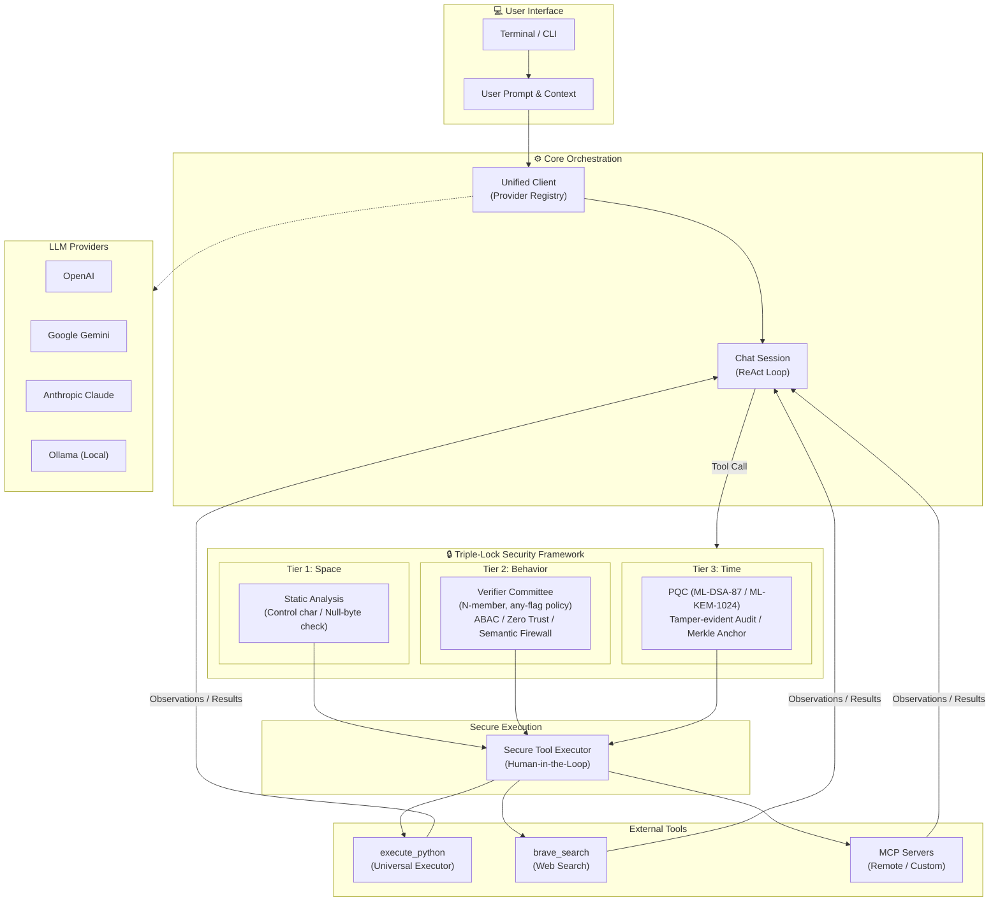

# llm-secure-cli: Unified OpenAI-Compatible CLI for AI Agents

[](https://github.com/yosh95/llm-secure-cli/actions/workflows/ci.yml)
[](LICENSE)
[](https://www.rust-lang.org)
[](https://doi.org/10.5281/zenodo.20428939)

`llm-secure-cli` (binary name: `llsc`) is a high-assurance command-line tool designed for interacting with Large Language Models (LLMs). It provides a unified, stable interface for any OpenAI-compatible API, including **OpenRouter, OpenAI, Ollama, and LiteLLM**, prioritizing cognitive focus, secure execution, and extensible automation.

---

###  Purpose & Positioning

Enterprise adoption of autonomous AI agents faces a fundamental, unsolved challenge: **how do you grant an AI meaningful agency while maintaining the security and governance standards that organizations require?** This project is one engineer's attempt to answer that question in working code.

`llm-secure-cli` was built primarily as a **personal daily-use tool** and as a **portfolio artifact** — a concrete demonstration of how CISSP/CISA/CCSP-level security principles (Zero Trust, ABAC, non-repudiation, PQC resilience) can be applied to the novel threat surface introduced by autonomous LLM agents.

**This tool is not certified or validated for enterprise production use.** No formal third-party security audit has been conducted, and the PQC primitives rely on Rust implementations that have not undergone independent cryptographic review. Deploying this in a regulated or mission-critical environment without additional validation would be inappropriate.

Instead, its recommended uses are:

-  **As a reference architecture** — for security engineers and architects exploring what a high-assurance agentic system *could* look like.
-  **As an evaluation platform** — for studying the practical trade-offs between AI agent autonomy and hybrid high-assurance security controls.
-  **As a design provocation** — a starting point for organizational discussions on agentic AI governance, not a finished answer.

The accompanying [Technical Report](paper/comprehensive_framework/paper.pdf) details the threat model and architectural decisions behind this framework.

---

###  Why Audit Logs? — Why AI Agents Need Auditing

Enterprise adoption of autonomous AI agents is hindered by two fundamental risks: **destructive actions** (unintended file modifications, system changes) and **information leakage** (exfiltration of sensitive data). Large Language Models are inherently black-box, stochastic systems — their behavior cannot be fully controlled or predicted through rules alone.

This tool addresses these challenges through two key mechanisms:

- **Verifier Committee (Multi-LLM Validation)**: Before any tool execution, N independent LLMs concurrently assess the proposed action for validity, safety, and information leakage risk. If any member flags a concern, the system escalates to Human-in-the-Loop (HITL) for approval.
- **Tamper-Evident Audit Logs**: Every action is recorded with its full reasoning chain — *why* the agent chose a particular tool with particular arguments — protected by chained hashing and PQC signatures (ML-DSA-87) to ensure non-repudiation and auditability.

The design philosophy draws inspiration from corporate governance: **just as artificial persons (corporations) are controlled through mandatory auditing, autonomous AI agents — another form of non-human actor — require audit-based control to be safely entrusted with agency.**

---

<p align="center">



  <br>
  <em>Simplified Architecture Flow</em>
</p>

---

##  Quick Start

1.  **Install**:
    ```bash
    # Install from source
    git clone https://github.com/yosh95/llm-secure-cli.git
    cd llm-secure-cli
    cargo install --path .
    ```
2.  **Set API Keys**: `llsc` uses OpenAI-compatible APIs. Set keys for your chosen provider.
    ```bash
    # Example for OpenRouter
    export OPENROUTER_API_KEY="your-api-key"
    
    # Generic provider name support
    # ANYNAME_API_KEY can be used if you define [ANYNAME] in config.toml
    ```

### 3. **Chat**: Type `llsc` to start an interactive session.

1.   **Automatic Initialization**: On the first run, `~/.llm_secure_cli/config.toml` is automatically created.
2.   **Model Setup**: By default, no model is selected. Use `/model <model_name>` (e.g., `/model llama3`) to set one before your first request.
3.   **Brave Search**: Built-in support for the Brave Search API is available for comprehensive searching across all providers (requires `BRAVE_API_KEY`).
4.   **File/URL Attachment**: Use `/attach <path|URL>` to quickly add local files or web content to your conversation.
5.  **Configure (Optional)**: Ollama is the default provider. To use OpenRouter or others, edit the configuration file:

    ```bash
    # Edit ~/.llm_secure_cli/config.toml
    ```

6.  **Help**: Type `/help` inside the chat to see all commands.

### Docker Isolation (Optional)
Run the agent in a completely isolated container to protect your host system. In `high` security mode (default), you must initialize the integrity manifest within the mounted volume.

1. **Build**: `docker build -t llm-secure-cli .`
2. **Setup API Keys**:
   - **Option A: `.env` file (Recommended)**: Place a `.env` file in your host's `~/.llm_secure_cli/` directory.
     ```bash
     # ~/.llm_secure_cli/.env
     OPENROUTER_API_KEY=sk-...
     OPENAI_API_KEY=sk-...
     ```
   - **Option B: Environment Variables**: Pass them via the `-e` flag during `docker run`.
3. **Run**:
   ```bash
   docker run -it --rm \
     -v ~/.llm_secure_cli:/home/agent/.llm_secure_cli \
     -v $(pwd):/workspace \
     llm-secure-cli -m llama3 "Summarize the files in this directory"
   ```

### One-Shot Examples
```bash
# Ask a question using the default provider (Ollama) and a specific model
llsc -m llama3 "What is the capital of France?"

# Use a specific provider and model (e.g., OpenRouter)
llsc -p openrouter -m google/gemini-2.0-flash-001 "Explain quantum computing"

# Output raw text to a file (disables Markdown rendering)
llsc -m llama3 --stdout --raw "Write a python script to sort files" > sort.py
```

## Core Features & Tools

- **Unified Provider Access**: Seamlessly switch between any OpenAI-compatible APIs (**OpenRouter, OpenAI, Ollama, LiteLLM**).
- **Autonomous Agent**: A streamlined set of built-in tools for complex automation:
    - **Universal Executor**: `execute_python` — run arbitrary Python code for any file operation, data processing, or computation task.
    - **Web Search**: `brave_search` — Brave LLM Context API for grounded, pre-extracted web content (LLM-optimized).
- **High-Assurance via Verifier Committee**: Every tool call is verified by the **Verifier Committee** — N independent LLMs operating concurrently under an "any-flag" policy — as a Semantic Firewall to ensure intent alignment.
- **MCP (Model Context Protocol)**: Connect to remote resources or services via custom servers.
- **Operational Stability**: A clean, flicker-free UI designed for long-term "Deep Work" sessions.
- **Human-in-the-Loop**: Configurable `auto_approval_level` (none/low/medium) to balance speed and safety.

### Autonomous Agent Capabilities
The AI agent autonomously selects tools to perform tasks. For example, it can search for a bug with Python file operations, read the relevant code, and apply a fix — all through `execute_python`. All actions are logged with cryptographic signatures for auditability.

---

## Security & Governance (High-Assurance Framework)

As a tool designed with **CISSP/CISA/CCSP** principles in mind, `llm-secure-cli` implements a multi-layered security architecture to mitigate the risks associated with autonomous AI agents.

### 1. Access Control (AI-native ABAC & Verifier Committee)
`llm-secure-cli` implements a modern **Attribute-Based Access Control (ABAC)**, moving away from fragile, platform-dependent static rules.
- **AI-native Policy Engine (Verifier Committee)**: Replaces complex regex blocklists with a hardcoded **Security Constitution**. The system automatically gathers context (OS, User, Directory, Git status) and uses N independent LLM verifiers to judge risks semantically using structured verdicts (ALLOW/REVIEW). This avoids the quagmire of platform-dependent static rules.
- **Any-Flag Policy**: The Verifier Committee runs ALL members concurrently. If ANY member flags a call as requiring review, human approval is mandatory. Only if ALL members approve is the call auto-approved.
- **Path Guardrails (Verifier-based)**: Path validation is handled entirely by the Verifier Committee. The static path whitelist has been removed — the verifier LLM uses its inherent knowledge of sensitive paths (like `C:\Windows` or `/etc`) together with the user's intent context to determine whether a file access is safe.
- **PQC at Maximum Strength (CASS)**: Security requirements (PQC signature level, audit encryption) are fixed at the highest available NIST Level 5 (**ML-DSA-87** for signing, **ML-KEM-1024** for encryption). Risk-level-based variant switching has been discontinued.
- **Intent Verification**: Every tool call is verified by the Verifier Committee. This acts as a **Semantic Firewall**, ensuring the proposed tool call aligns with the user's original intent and providing corrected arguments if small discrepancies are detected.
- **Minimalist Fast-fail**: A lightweight syntactic check blocks only control characters and NULL bytes in **nanoseconds**, while the heavy lifting of security judgment is shifted to the Verifier Committee. Shell invocation pattern detection has been removed as redundant — the Verifier Committee handles all semantic analysis.
- **Verifier Fallback**: When the verifier is unavailable (network error, API failure), the system always asks for human approval. The `block` option has been removed — the verifier fallback now always requires manual confirmation.
- **Auto-Approval Levels**: The `auto_approval_level` setting controls which tool calls can proceed without human intervention: `none` (default, all require approval), `low` (auto-approve low-risk), `medium` (auto-approve low and medium-risk).
- **Physical Isolation (Docker)**: The agent can be run inside a Docker container to provide a hard boundary between the AI and the host system.

### 2. Identity & Non-Repudiation (Experimental Reference)
- **Distributed Trust Model**: Implements a decentralized identity model where clients and servers only exchange public keys. This is designed to explore how to prevent lateral movement if a single component is compromised; however, it requires thorough evaluation before use in production environments.
- **Hybrid Identity Tokens**: Uses **COSE (RFC 9052)** binary structures combining **Ed25519** with **Post-Quantum Cryptography (ML-DSA)**. This serves as a reference for how long-term non-repudiation might be handled in autonomous agent systems.
- **Client Integrity Attestation**: The client generates a signed manifest of its own source code state to demonstrate the integrity of the execution environment.
- **Bi-directional Verification**: Tool results can be signed by the responder, allowing the requester to verify that the observations are authentic and untampered within the protocol's scope.

### 3. Observability & Audit Compliance (Tier 3 Reference Implementation)
- **Tamper-Evident Audit Logs**: Audit trails are protected using **Chained Hashing** and optionally encrypted with **ML-KEM (Kyber)** for confidentiality.
- **Merkle Tree Anchoring**: The Tier 3 implementation uses Merkle Trees to anchor log batches, demonstrating an architecture to prevent historical revisionism and provide compact proofs of session integrity.

---

##  Advanced Commands & Power User Tips

### Command-Line Flags
```bash
llsc [SOURCES...]                    # Start interactive chat (optional initial text/files)
llsc -p <provider>                   # Start with specific provider
llsc -m <model>                      # Start with specific model alias
llsc --stdout                        # Non-interactive mode, output to stdout
llsc --raw                           # Disable Markdown rendering (use with --stdout)
llsc --mcp-server                    # Run as an MCP server (stdio transport)
llsc --session <path>                # Load a saved session on startup
llsc "query"                         # One-shot query
```

### Subcommands
```bash
llsc identity keygen                 # Generate Ed25519 and PQC (ML-DSA/ML-KEM) key pairs
llsc identity manifest               # Rebuild integrity manifest for system verification
llsc identity verify                 # Run full integrity verification
llsc identity verify-session <id>    # Verify session integrity using Merkle Anchor
llsc identity list-sessions          # List available anchored sessions
llsc decrypt-log <input> [-o <out>]  # Decrypt PQC-encrypted audit logs
llsc verify-skill <path>             # Verify Agent Skills for safety (structural, signature, semantic)
```

### Interactive Session Commands
Inside the `llsc` interactive session:
- `/help`, `/h`: Show help message.
- `/quit`, `/q`: Exit the application.
- `/verify [on|off]`: Show or toggle verifier status.
- `/edit`, `/e`: Edit current buffer in external editor.
- `/clear`, `/c`: Clear conversation history.
- `/info`, `/i`: Show session info, integrity, and security status.
- `/raw`: Show conversation as raw text.
- `/dump`: Dump conversation history as TOML.
- `/session [load|delete <id>|clear]`: List, load, delete, or clear saved sessions.
- `/attach <path/URL>`: Add a file or website content to the context.
- `/tools [on|off]`: Show or toggle autonomous tool use status.
- `/model`, `/m [-u] [<alias>]`: List models for current provider. Use `-u`/`--update` to refresh the cache. Specify an alias or model name to switch.
- `/vmodel`, `/vm [-u] [<name>]`: List models for the verifier. Use `-u`/`--update` to refresh the cache.
- `/alias` — list all; `/alias <name>` — show one; `/alias <name> <target>` — create/update; `/alias -d <name>` — delete.
- `/provider`, `/p [<name>]`: Switch or list providers.
- `/summarize`, `/s`: Summarize history and clear it (context preservation).

### Keybindings
- **Newline**: `Ctrl+J` (Insert a newline without submitting).
- **Clear Screen**: `Ctrl+L`.
- **History**: `Up/Down` arrows to navigate.
- **Interrupt**: `Ctrl+C` to cancel the current thinking process or exit the session.

### Power User Tips
- **Backgrounding (`Ctrl+Z`)**: Suspend the session to perform shell operations, then use `fg` to return.
- **Prompt Continuation**: Use `\` at the end of a line or open a code block with ``` to enter multi-line mode automatically.
- **External Editor**: Use `/edit` (or `/e`) for composing complex prompts in your default editor (`vim`, `nano`, etc.).
- **Disabling Tools Manually**: Use `/tools off` to prevent errors when using a model that doesn't support function calling.

## Security Configuration Reference

The primary security configuration is in `src/config/defaults.toml` (overridden by `~/.llm_secure_cli/config.toml`):

### Verifier Committee Configuration
The Verifier Committee uses N independent LLM verifiers with an "any-flag" policy:

```toml
[security]
# Verifier Committee (AI-native ABAC / Semantic Firewall)
verifier_enabled = true
verifier_provider = "ollama"
verifier_model = "gemma4:e2b"

# Additional committee members (optional)
[security.verifier_committee]
members = [
  { provider = "openai", model = "gpt-4o-mini" },
  { provider = "openrouter", model = "anthropic/claude-3-haiku" },
]
```

### MCP Server Configuration
Configure remote MCP servers in `config.toml`:

```toml
[[mcp_servers]]
name   = "my-server"
command = "ssh"
args   = ["user@host", "llsc", "--mcp-server"]
zero_trust = true
```

---

## Agent Skill Verification

`llsc` provides a **three-tier verification pipeline** for [Agent Skills](https://agentskills.io/specification) — structural validation, Ed25519/ML-DSA signature verification, and Verifier Committee Semantic Firewall analysis — that audits skills before installation without executing them.  See **[docs/AGENT_SKILLS.md](docs/AGENT_SKILLS.md)** for the full rationale, usage, and threat model.

```bash
llsc verify-skill ./path/to/skill/           # Human-readable report
llsc verify-skill ~/.claude/skills/ --recursive  # Batch scan
llsc verify-skill ./skill/ --semantic        # Full Semantic Firewall analysis
```

## Development & Benchmarks
To run the local security primitive benchmarks (Static Analysis, PQC Keygen/Sign/Verify):
```bash
cargo bench --bench benchmark_local
```

To run the internal Verifier benchmark scenarios (requires API keys):
```bash
# Basic usage
cargo bench --bench benchmark_verifier -- <provider> <model>

# Example: Run with OpenRouter
cargo bench --bench benchmark_verifier -- openrouter amazon/nova-2-lite-v1

# Example: Run with Ollama
cargo bench --bench benchmark_verifier -- ollama llama3

# Or with a custom scenarios JSON file:
cargo bench --bench benchmark_verifier -- <provider> <model> path/to/your_scenarios.json
```

##  Development

### Prerequisites

- **Rust** 1.95.0 or later (edition 2024)
- **[just](https://github.com/casey/just)** — a modern command runner (optional, but recommended)

### Quick Checks with `just`

The project includes a `justfile` with common recipes:

```bash
# Show all available commands
just

# Format code
just fmt

# Run clippy with strict lints
just clippy

# Run all tests
just test

# Full CI pipeline (format → clippy → test → build-release)
just ci

# Install the binary locally
just install

# Run the application
just run
```

### CI/CD

CI runs on every push and pull request via [GitHub Actions](.github/workflows/ci.yml):

| Job | Description |
|-----|-------------|
| **Format** | `cargo fmt --check` |
| **Build & Test** | `cargo clippy`, `cargo build --release`, `cargo test` on Ubuntu, macOS, and Windows |
| **Security Audit** | `cargo audit` for dependency vulnerabilities |
| **Docs** | `cargo doc` with warnings as errors |

### Running Benchmarks

```bash
# Local security primitive benchmarks
just bench-local

# Verifier benchmarks (requires API keys)
just bench-verifier openrouter google/gemini-3.1-flash-lite
```

##  License
Licensed under [Apache License 2.0](LICENSE). 

For detailed architectural insights and the academic background of our security framework, please refer to the **[Technical Report (Pre-print)](paper/comprehensive_framework/paper.pdf)**.

