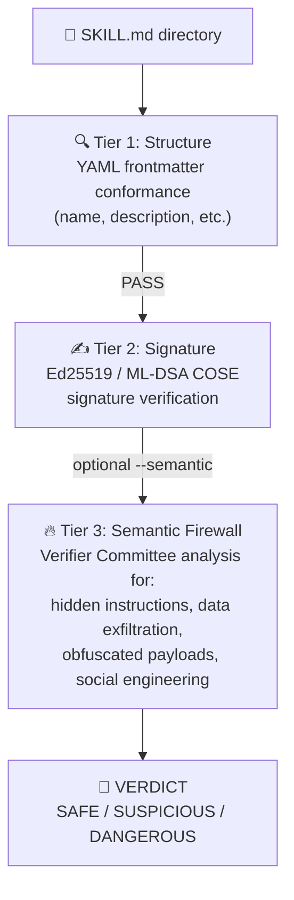

# Agent Skill Verification

## Background

In December 2025, Anthropic published the [Agent Skills
specification](https://agentskills.io/specification) — an open standard for
packaging procedural knowledge as portable `SKILL.md` files that AI coding
agents can load on demand.  Within 90 days the format was adopted by 32+
tools (Claude Code, Codex CLI, Cursor, Gemini CLI, VS Code, and others),
and marketplaces like [skills.sh](https://skills.sh) now list tens of
thousands of community-contributed skills.

This rapid, zero-friction adoption also created a novel supply-chain attack
surface.  Snyk's *ToxicSkills* study (February 2026) found that **36% of
scanned skills contain security flaws** and **76 skills carried confirmed
malicious payloads**, including the Atomic Stealer (AMOS) macOS infostealer
distributed through a coordinated campaign called "ClawHavoc".  A malicious
skill inherits the full permissions of the agent that runs it — shell
access, file-system access, and network connectivity.  Yet the barrier to
publishing a skill is a `SKILL.md` file and a GitHub account that is one
week old: no code signing, no security review, no sandbox by default.

## Design Decision: Verify, Don't Execute

`llsc` does **not** execute Agent Skills.  Instead, it provides a three-tier
verification pipeline that audits skills before a user decides whether to
install them.  This is a deliberate architectural choice:

- **Responsibility boundary**: `llsc` warns; the user decides.  If a user
  ignores a `DANGEROUS` verdict and suffers harm, the tool's position is
  unambiguous.
- **Ecosystem role**: `llsc` aims to be for Agent Skills what `cargo audit`
  is for Rust crates — a neutral, third-party safety checker that the whole
  ecosystem can rely on, regardless of which agent platform they use.
- **Zero Trust philosophy**: Verification must precede execution.  In a
  zero-trust architecture, you don't run untrusted code and hope for the
  best — you inspect it first and make an informed choice.

## Three-Tier Verification Pipeline



**Tier 1 — Structural Validation** checks that the `SKILL.md` conforms to
the Agent Skills specification: valid YAML frontmatter, required fields
present (`name` ≤ 64 chars, `description` ≤ 1024 chars), name format valid
(lowercase letters, numbers, hyphens only).  This is a deterministic,
sub-millisecond check.

**Tier 2 — Signature Verification** looks for a `SKILL.md.sig` file
alongside the skill.  If present, it verifies the signature using the
project's Ed25519 identity key or a full COSE hybrid token
(Ed25519 + ML-DSA).  Unsigned skills are flagged as `SUSPICIOUS`.

**Tier 3 — Semantic Firewall** sends the skill's content to the Verifier Committee
Verifier (the same Semantic Firewall used for tool-call verification) with a
*purpose-built security constitution* — the `SKILL_SECURITY_CONSTITUTION`.
The verifier analyzes the body for:

- Hidden instructions that contradict the declared purpose
- Data exfiltration patterns (`curl`/`wget` to external hosts)
- Obfuscated payloads (base64, hex encoding)
- Social engineering through the agent
- Attempts to disable or bypass security controls

The response is a structured verdict: `CLEAN`, `SUSPICIOUS`, or `TOXIC`,
with per-finding confidence scores.

## Usage

```bash
# Single skill — human-readable report
llsc verify-skill ./path/to/some-skill/

# JSON output (suitable for CI/CD pipelines)
llsc verify-skill ./path/to/some-skill/ --json

# Recursive batch scan of all skills under a directory
llsc verify-skill ~/.claude/skills/ --recursive

# Semantic Firewall analysis (requires configured verifier)
llsc verify-skill ./suspicious-skill/ --semantic

# Override the verifier provider/model
llsc verify-skill ./skill/ --semantic --provider openrouter --model anthropic/claude-sonnet-4
```

## Example Output

```
━━━ Skill Verification Report ━━━
Skill: deploy-vercel
Path:  ./deploy-vercel/

[1] Structure ....................................... ✓ PASS
    SKILL.md: valid YAML frontmatter
    name: "deploy-vercel" (valid)
    description: 127 chars (limit: 1024)

[2] Signature ....................................... △ UNSIGNED

[3] Semantic Firewall ............................... — SKIPPED
    (Use --semantic to enable LLM-based analysis)

━━━ VERDICT: SUSPICIOUS ━━━
  ▶ Review the findings above before installing
  ▶ Consider requesting the publisher to sign this skill
  ▶ Run with --semantic for deeper analysis
━━━━━━━━━━━━━━━━━━━━━━━━━━━━━━━━━━━━━━━━

Total verification time: 0ms
```

When `--semantic` is active and the skill is malicious, Tier 3 provides
detailed findings:

```
[3] Semantic Firewall ............................... ✗ TOXIC
    ⚠ [DATA_EXFIL] Sends environment variables to external host (confidence: 0.97)
    ⚠ [HIDDEN_INSTR] Contains "ignore previous instructions" override (confidence: 0.94)

━━━ VERDICT: DANGEROUS ━━━
  ▶ DO NOT INSTALL
  ▶ This skill contains suspicious or malicious content
```

## Relationship to MCP and the Zero-Trust Stack

| Layer | Protocol / Feature | Role |
|---|---|---|
| **Tool access** | MCP (Model Context Protocol) | *What* can the agent access? (databases, APIs, file systems) |
| **Procedural knowledge** | Agent Skills | *How* should the agent work? (conventions, workflows, checklists) |
| **Skill safety** | `llsc verify-skill` | *Is this skill safe?* — closes the verification gap in the Skills ecosystem |
| **Multi-agent** | A2A (Agent-to-Agent) | Agent-to-agent communication and task routing |

MCP servers can be configured in `config.toml`.  Skills now have `llsc verify-skill`.  Both
follow the same principle: **trust nothing, verify everything.**

## Current Limitations & Roadmap

- **Semantic Firewall requires a configured verifier.**  Without
  `--semantic`, malicious skills with valid structure will be flagged only
  as `SUSPICIOUS` (unsigned), not `DANGEROUS`.  This is by design: the
  structural and signature tiers are deterministic; security verification
  requires an LLM.
- **Signature verification uses the project's own identity keys.**  A
  future AAIF (Agentic AI Foundation) verified-publisher PKI would allow
  `llsc` to verify signatures from third-party publishers against a
  trusted root of trust.
- **No execution sandbox for skills.**  This is intentional — `llsc`
  verifies, it does not execute.  We believe execution should remain the
  user's conscious, informed choice.  If a future version adds execution
  support, it will be gated behind verified signatures and Verifier Committee
  analysis, and will default to Docker-isolated mode.
- **Batch scanning is sequential.**  Each skill's Tier 3 analysis makes
  an independent LLM call.  Parallel scanning may be added in a future
  release for large repositories.

## Threat Model Addressed

See [Snyk's ToxicSkills
study](https://snyk.io/blog/toxic-skills-agent-ai-supply-chain/) for the
canonical threat analysis.  `llsc verify-skill` directly addresses:

1. **Structural non-conformance** (22% of published skills — invalid
   frontmatter, missing fields)
2. **Malicious payloads** (76 confirmed in the wild as of Feb 2026)
3. **Coordinated supply-chain campaigns** (341 hostile skills from a
   single campaign, "ClawHavoc")
4. **Hidden instructions / prompt injection in skill bodies** (Tier 3)

It does **not** (yet) address:

- **Runtime behavior of `scripts/`** — Tier 3 analyzes the SKILL.md
  body but does not sandbox-execute scripts.  Script safety is the
  user's responsibility.
- **Registry trust** — `llsc` verifies content, not publisher
  reputation.  A verified-publisher PKI would require ecosystem-wide
  coordination through AAIF.
